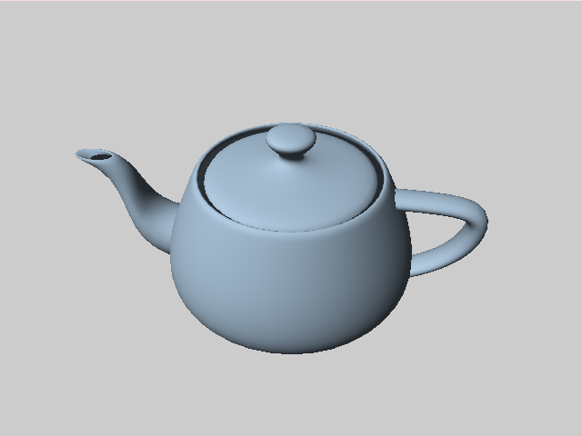

# Haskell OpenGL Mesh Viewer
An opengl mesh viewer. Works with Wavefront OBJ files, 
and tested with .png textures. Uses a simple Phong Shader algorithm,
following [this tutorial](https://duriansoftware.com/joe/an-intro-to-modern-opengl.-chapter-4:-rendering-a-dynamic-3d-scene-with-phong-shading).
Builds upon [hcubegl](https://github.com/noodles623/hcubegl).

# How to install
This program uses [stack](https://github.com/commercialhaskell/stack)
Install stack and run `stack build` to compile the program.

# Usage
Place the .obj file you want to load and the image you want to texture in the
resources folder. Execute the following command to start the program.
```
$ stack run [width] [height] [mesh.obj] [image.png]
```
Where width and height are the resolution of the window. 

## NOTE
The camera is at a fixed angle meant for viewing the provided teapot mesh, and 
other models my be off-center or out of frame. To manually adjust the camera,
change the input to the `dolly` function in [Mesh.hs](src/Mesh.hs) on line 91,
and recompile with `stack build`.

# Example usage
To view the teapot mesh in the sample directory with a blue texture, run
```
$ stack run 640 480 teapot.obj blue.png
```

